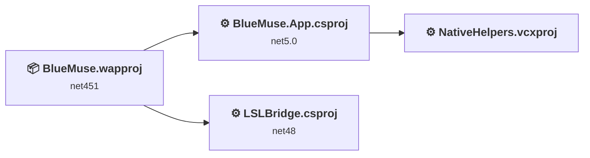
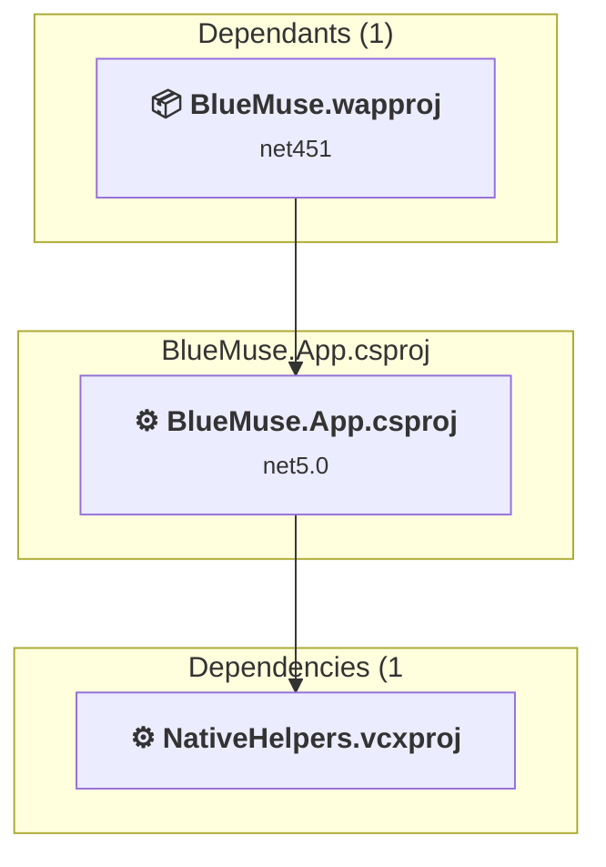
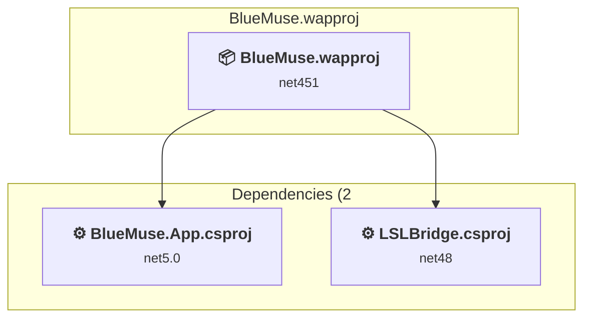
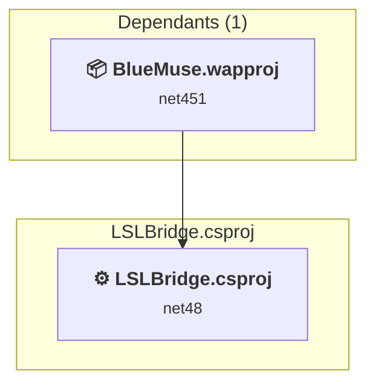
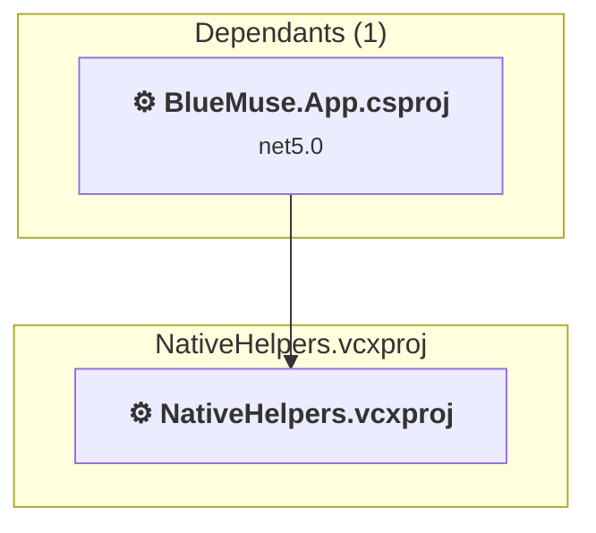

# Projects and dependencies analysis

This document provides a comprehensive overview of the projects and their dependencies in the context of upgrading to .NETCoreApp,Version=v10.0.

## Table of Contents

- [Executive Summary](#executive-Summary)
  - [Highlevel Metrics](#highlevel-metrics)
  - [Projects Compatibility](#projects-compatibility)
  - [Package Compatibility](#package-compatibility)
  - [API Compatibility](#api-compatibility)
  - [Binding Redirect Configuration](#binding-redirect-configuration)
- [Aggregate NuGet packages details](#aggregate-nuget-packages-details)
- [Top API Migration Challenges](#top-api-migration-challenges)
  - [Technologies and Features](#technologies-and-features)
  - [Most Frequent API Issues](#most-frequent-api-issues)
- [Projects Relationship Graph](#projects-relationship-graph)
- [Project Details](#project-details)

  - [BlueMuse.App\BlueMuse.App.csproj](#bluemuseappbluemuseappcsproj)
  - [BlueMuse\BlueMuse.wapproj](#bluemusebluemusewapproj)
  - [LSLBridge\LSLBridge.csproj](#lslbridgelslbridgecsproj)
  - [NativeHelpers\NativeHelpers.vcxproj](#nativehelpersnativehelpersvcxproj)

## Executive Summary

### Highlevel Metrics

| Metric | Count | Status |
| :--- | :---: | :--- |
| Total Projects | 4 | 3 require upgrade |
| Total NuGet Packages | 61 | 2 need upgrade |
| Total Code Files | 45 |  |
| Total Code Files with Incidents | 19 |  |
| Total Lines of Code | 6133 |  |
| Total Number of Issues | 218 |  |
| Estimated LOC to modify | 130+ | at least 2.1% of codebase |

### Projects Compatibility

| Project | Target Framework | Difficulty | Package Issues | API Issues | Binding Issues | Est. LOC Impact | Description |
| :--- | :---: | :---: | :---: | :---: | :---: | :---: | :--- |
| [BlueMuse.App\BlueMuse.App.csproj](#bluemuseappbluemuseappcsproj) | net5.0 | 🟢 Low | 2 | 24 | 1 | 24+ | Uwp, Sdk Style = False |
| [BlueMuse\BlueMuse.wapproj](#bluemusebluemusewapproj) | net451 | 🟢 Low | 0 | 0 | 0 |  | DotNetCoreApp, Sdk Style = True |
| [LSLBridge\LSLBridge.csproj](#lslbridgelslbridgecsproj) | net48 | 🟡 Medium | 50 | 106 | 30 | 106+ | ClassicWpf, Sdk Style = False |
| [NativeHelpers\NativeHelpers.vcxproj](#nativehelpersnativehelpersvcxproj) |  | ✅ None | 0 | 0 | 0 |  | ClassicClassLibrary, Sdk Style = False |

### Package Compatibility

| Status | Count | Percentage |
| :--- | :---: | :---: |
| ✅ Compatible | 59 | 96.7% |
| ⚠️ Incompatible | 1 | 1.6% |
| 🔄 Upgrade Recommended | 1 | 1.6% |
| ***Total NuGet Packages*** | ***61*** | ***100%*** |

### API Compatibility

| Category | Count | Impact |
| :--- | :---: | :--- |
| 🔴 Binary Incompatible | 99 | High - Require code changes |
| 🟡 Source Incompatible | 17 | Medium - Needs re-compilation and potential conflicting API error fixing |
| 🔵 Behavioral change | 14 | Low - Behavioral changes that may require testing at runtime |
| ✅ Compatible | 8099 |  |
| ***Total APIs Analyzed*** | ***8229*** |  |

### Binding Redirect Configuration

| Severity | Count | Description |
| :--- | :---: | :--- |
| 🔴Mandatory | 4 | Must be fixed to avoid runtime failures |
| 🟡Potential | 27 | May cause issues in certain scenarios |
| ***Total Binding Issues*** | ***31*** | ***Across 2 project(s)*** |

## Aggregate NuGet packages details

| Package | Current Version | Suggested Version | Projects | Description |
| :--- | :---: | :---: | :--- | :--- |
| Costura.Fody | 6.2.0 |  | [LSLBridge.csproj](#lslbridgelslbridgecsproj) | ✅Compatible |
| Fody | 6.9.3 |  | [LSLBridge.csproj](#lslbridgelslbridgecsproj) | ✅Compatible |
| Microsoft.NETCore.Platforms | 7.0.4 |  | [LSLBridge.csproj](#lslbridgelslbridgecsproj) | NuGet package functionality is included with framework reference |
| Microsoft.NETCore.UniversalWindowsPlatform | 6.2.14 |  | [BlueMuse.App.csproj](#bluemuseappbluemuseappcsproj) | Needs to be replaced with Replace with new package Microsoft.WindowsAppSDK=2.3.1;Microsoft.Graphics.Win2D=1.1.0;Microsoft.Windows.Compatibility=10.0.10 |
| Microsoft.Win32.Primitives | 4.3.0 |  | [LSLBridge.csproj](#lslbridgelslbridgecsproj) | NuGet package functionality is included with framework reference |
| NETStandard.Library | 2.0.3 |  | [LSLBridge.csproj](#lslbridgelslbridgecsproj) | NuGet package functionality is included with framework reference |
| Newtonsoft.Json | 13.0.4 |  | [BlueMuse.App.csproj](#bluemuseappbluemuseappcsproj) [LSLBridge.csproj](#lslbridgelslbridgecsproj) | ✅Compatible |
| Serilog | 4.4.0 |  | [BlueMuse.App.csproj](#bluemuseappbluemuseappcsproj) [LSLBridge.csproj](#lslbridgelslbridgecsproj) | ✅Compatible |
| Serilog.Exceptions | 8.4.0 |  | [BlueMuse.App.csproj](#bluemuseappbluemuseappcsproj) [LSLBridge.csproj](#lslbridgelslbridgecsproj) | ✅Compatible |
| Serilog.Sinks.File | 7.0.0 |  | [BlueMuse.App.csproj](#bluemuseappbluemuseappcsproj) [LSLBridge.csproj](#lslbridgelslbridgecsproj) | ✅Compatible |
| Serilog.Sinks.RollingFile | 3.3.0 |  | [BlueMuse.App.csproj](#bluemuseappbluemuseappcsproj) [LSLBridge.csproj](#lslbridgelslbridgecsproj) | ⚠️NuGet package is deprecated |
| System.AppContext | 4.3.0 |  | [LSLBridge.csproj](#lslbridgelslbridgecsproj) | NuGet package functionality is included with framework reference |
| System.Buffers | 4.6.1 |  | [LSLBridge.csproj](#lslbridgelslbridgecsproj) | NuGet package functionality is included with framework reference |
| System.Collections | 4.3.0 |  | [LSLBridge.csproj](#lslbridgelslbridgecsproj) | NuGet package functionality is included with framework reference |
| System.Collections.Concurrent | 4.3.0 |  | [LSLBridge.csproj](#lslbridgelslbridgecsproj) | NuGet package functionality is included with framework reference |
| System.Console | 4.3.1 |  | [LSLBridge.csproj](#lslbridgelslbridgecsproj) | NuGet package functionality is included with framework reference |
| System.Diagnostics.Debug | 4.3.0 |  | [LSLBridge.csproj](#lslbridgelslbridgecsproj) | NuGet package functionality is included with framework reference |
| System.Diagnostics.DiagnosticSource | 10.0.10 |  | [LSLBridge.csproj](#lslbridgelslbridgecsproj) | ✅Compatible |
| System.Diagnostics.Tools | 4.3.0 |  | [LSLBridge.csproj](#lslbridgelslbridgecsproj) | NuGet package functionality is included with framework reference |
| System.Diagnostics.Tracing | 4.3.0 |  | [LSLBridge.csproj](#lslbridgelslbridgecsproj) | NuGet package functionality is included with framework reference |
| System.Globalization | 4.3.0 |  | [LSLBridge.csproj](#lslbridgelslbridgecsproj) | NuGet package functionality is included with framework reference |
| System.Globalization.Calendars | 4.3.0 |  | [LSLBridge.csproj](#lslbridgelslbridgecsproj) | NuGet package functionality is included with framework reference |
| System.IO | 4.3.0 |  | [LSLBridge.csproj](#lslbridgelslbridgecsproj) | NuGet package functionality is included with framework reference |
| System.IO.Compression | 4.3.0 |  | [LSLBridge.csproj](#lslbridgelslbridgecsproj) | NuGet package functionality is included with framework reference |
| System.IO.Compression.ZipFile | 4.3.0 |  | [LSLBridge.csproj](#lslbridgelslbridgecsproj) | NuGet package functionality is included with framework reference |
| System.IO.FileSystem | 4.3.0 |  | [LSLBridge.csproj](#lslbridgelslbridgecsproj) | NuGet package functionality is included with framework reference |
| System.IO.FileSystem.Primitives | 4.3.0 |  | [LSLBridge.csproj](#lslbridgelslbridgecsproj) | NuGet package functionality is included with framework reference |
| System.Linq | 4.3.0 |  | [LSLBridge.csproj](#lslbridgelslbridgecsproj) | NuGet package functionality is included with framework reference |
| System.Linq.Expressions | 4.3.0 |  | [LSLBridge.csproj](#lslbridgelslbridgecsproj) | NuGet package functionality is included with framework reference |
| System.Memory | 4.6.3 |  | [LSLBridge.csproj](#lslbridgelslbridgecsproj) | NuGet package functionality is included with framework reference |
| System.Net.Http | 4.3.4 |  | [LSLBridge.csproj](#lslbridgelslbridgecsproj) | NuGet package functionality is included with framework reference |
| System.Net.Primitives | 4.3.1 |  | [LSLBridge.csproj](#lslbridgelslbridgecsproj) | NuGet package functionality is included with framework reference |
| System.Net.Sockets | 4.3.0 |  | [LSLBridge.csproj](#lslbridgelslbridgecsproj) | NuGet package functionality is included with framework reference |
| System.Numerics.Vectors | 4.6.1 |  | [LSLBridge.csproj](#lslbridgelslbridgecsproj) | NuGet package functionality is included with framework reference |
| System.ObjectModel | 4.3.0 |  | [LSLBridge.csproj](#lslbridgelslbridgecsproj) | NuGet package functionality is included with framework reference |
| System.Reflection | 4.3.0 |  | [LSLBridge.csproj](#lslbridgelslbridgecsproj) | NuGet package functionality is included with framework reference |
| System.Reflection.Extensions | 4.3.0 |  | [LSLBridge.csproj](#lslbridgelslbridgecsproj) | NuGet package functionality is included with framework reference |
| System.Reflection.Primitives | 4.3.0 |  | [LSLBridge.csproj](#lslbridgelslbridgecsproj) | NuGet package functionality is included with framework reference |
| System.Resources.ResourceManager | 4.3.0 |  | [LSLBridge.csproj](#lslbridgelslbridgecsproj) | NuGet package functionality is included with framework reference |
| System.Runtime | 4.3.1 |  | [LSLBridge.csproj](#lslbridgelslbridgecsproj) | NuGet package functionality is included with framework reference |
| System.Runtime.CompilerServices.Unsafe | 6.1.2 |  | [LSLBridge.csproj](#lslbridgelslbridgecsproj) | ✅Compatible |
| System.Runtime.Extensions | 4.3.1 |  | [LSLBridge.csproj](#lslbridgelslbridgecsproj) | NuGet package functionality is included with framework reference |
| System.Runtime.Handles | 4.3.0 |  | [LSLBridge.csproj](#lslbridgelslbridgecsproj) | ✅Compatible |
| System.Runtime.InteropServices | 4.3.0 |  | [LSLBridge.csproj](#lslbridgelslbridgecsproj) | NuGet package functionality is included with framework reference |
| System.Runtime.InteropServices.RuntimeInformation | 4.3.0 |  | [LSLBridge.csproj](#lslbridgelslbridgecsproj) | NuGet package functionality is included with framework reference |
| System.Runtime.Numerics | 4.3.0 |  | [LSLBridge.csproj](#lslbridgelslbridgecsproj) | NuGet package functionality is included with framework reference |
| System.Security.Cryptography.Algorithms | 4.3.1 |  | [LSLBridge.csproj](#lslbridgelslbridgecsproj) | NuGet package functionality is included with framework reference |
| System.Security.Cryptography.Encoding | 4.3.0 |  | [LSLBridge.csproj](#lslbridgelslbridgecsproj) | NuGet package functionality is included with framework reference |
| System.Security.Cryptography.Primitives | 4.3.0 |  | [LSLBridge.csproj](#lslbridgelslbridgecsproj) | NuGet package functionality is included with framework reference |
| System.Security.Cryptography.X509Certificates | 4.3.2 |  | [LSLBridge.csproj](#lslbridgelslbridgecsproj) | NuGet package functionality is included with framework reference |
| System.Text.Encoding | 4.3.0 |  | [LSLBridge.csproj](#lslbridgelslbridgecsproj) | NuGet package functionality is included with framework reference |
| System.Text.Encoding.Extensions | 4.3.0 |  | [LSLBridge.csproj](#lslbridgelslbridgecsproj) | NuGet package functionality is included with framework reference |
| System.Text.RegularExpressions | 4.3.1 |  | [LSLBridge.csproj](#lslbridgelslbridgecsproj) | NuGet package functionality is included with framework reference |
| System.Threading | 4.3.0 |  | [LSLBridge.csproj](#lslbridgelslbridgecsproj) | NuGet package functionality is included with framework reference |
| System.Threading.Channels | 8.0.0 | 10.0.10 | [LSLBridge.csproj](#lslbridgelslbridgecsproj) | NuGet package upgrade is recommended |
| System.Threading.Tasks | 4.3.0 |  | [LSLBridge.csproj](#lslbridgelslbridgecsproj) | NuGet package functionality is included with framework reference |
| System.Threading.Tasks.Extensions | 4.5.4 |  | [LSLBridge.csproj](#lslbridgelslbridgecsproj) | NuGet package functionality is included with framework reference |
| System.Threading.Timer | 4.3.0 |  | [LSLBridge.csproj](#lslbridgelslbridgecsproj) | NuGet package functionality is included with framework reference |
| System.Xml.ReaderWriter | 4.3.1 |  | [LSLBridge.csproj](#lslbridgelslbridgecsproj) | NuGet package functionality is included with framework reference |
| System.Xml.XDocument | 4.3.0 |  | [LSLBridge.csproj](#lslbridgelslbridgecsproj) | NuGet package functionality is included with framework reference |
| UwpDesktop | 10.0.14393.3 |  | [LSLBridge.csproj](#lslbridgelslbridgecsproj) | ✅Compatible |

## Top API Migration Challenges

### Technologies and Features

| Technology | Issues | Percentage | Migration Path |
| :--- | :---: | :---: | :--- |
| WPF (Windows Presentation Foundation) | 27 | 20.8% | WPF APIs for building Windows desktop applications with XAML-based UI that are available in .NET on Windows. WPF provides rich desktop UI capabilities with data binding and styling. Enable Windows Desktop support: Option 1 (Recommended): Target net9.0-windows; Option 2: Add <UseWindowsDesktop>true</UseWindowsDesktop>. |
| Legacy Configuration System | 2 | 1.5% | Legacy XML-based configuration system (app.config/web.config) that has been replaced by a more flexible configuration model in .NET Core. The old system was rigid and XML-based. Migrate to Microsoft.Extensions.Configuration with JSON/environment variables; use System.Configuration.ConfigurationManager NuGet package as interim bridge if needed. |

### Most Frequent API Issues

| API | Count | Percentage | Category |
| :--- | :---: | :---: | :--- |
| T:System.Windows.Visibility | 20 | 15.4% | Binary Incompatible |
| T:System.Windows.Application | 14 | 10.8% | Binary Incompatible |
| T:System.Uri | 10 | 7.7% | Behavioral Change |
| T:System.Runtime.InteropServices.WindowsRuntime.WindowsRuntimeBufferExtensions | 5 | 3.8% | Source Incompatible |
| P:System.Windows.Application.Current | 5 | 3.8% | Binary Incompatible |
| T:System.Windows.Threading.Dispatcher | 4 | 3.1% | Binary Incompatible |
| P:System.Windows.Threading.DispatcherObject.Dispatcher | 4 | 3.1% | Binary Incompatible |
| T:System.Windows.Data.IValueConverter | 4 | 3.1% | Binary Incompatible |
| T:System.Windows.StartupEventHandler | 4 | 3.1% | Binary Incompatible |
| T:System.Windows.Threading.DispatcherUnhandledExceptionEventHandler | 4 | 3.1% | Binary Incompatible |
| M:System.Runtime.InteropServices.WindowsRuntime.WindowsRuntimeBufferExtensions.GetByte(Windows.Storage.Streams.IBuffer,System.UInt32) | 3 | 2.3% | Source Incompatible |
| F:System.Windows.Visibility.Visible | 3 | 2.3% | Binary Incompatible |
| T:System.Windows.Threading.DispatcherOperation | 3 | 2.3% | Binary Incompatible |
| M:System.Windows.Threading.Dispatcher.InvokeAsync(System.Action) | 3 | 2.3% | Binary Incompatible |
| M:System.Runtime.InteropServices.WindowsRuntime.WindowsRuntimeBufferExtensions.ToArray(Windows.Storage.Streams.IBuffer,System.UInt32,System.Int32) | 2 | 1.5% | Source Incompatible |
| T:Windows.Foundation.Size | 2 | 1.5% | Source Incompatible |
| F:System.Windows.Visibility.Collapsed | 2 | 1.5% | Binary Incompatible |
| P:System.Windows.Application.ResourceAssembly | 2 | 1.5% | Binary Incompatible |
| P:System.Windows.FrameworkElement.DataContext | 2 | 1.5% | Binary Incompatible |
| M:System.Windows.Window.#ctor | 2 | 1.5% | Binary Incompatible |
| T:System.Windows.PresentationSource | 2 | 1.5% | Binary Incompatible |
| M:System.Uri.#ctor(System.String,System.UriKind) | 2 | 1.5% | Behavioral Change |
| E:System.Windows.Application.Startup | 2 | 1.5% | Binary Incompatible |
| E:System.Windows.Application.DispatcherUnhandledException | 2 | 1.5% | Binary Incompatible |
| M:System.Windows.Application.#ctor | 2 | 1.5% | Binary Incompatible |
| T:System.Runtime.InteropServices.WindowsRuntime.WindowsRuntimeBuffer | 1 | 0.8% | Source Incompatible |
| M:System.Runtime.InteropServices.WindowsRuntime.WindowsRuntimeBuffer.Create(System.Byte[],System.Int32,System.Int32,System.Int32) | 1 | 0.8% | Source Incompatible |
| P:System.Uri.PathAndQuery | 1 | 0.8% | Behavioral Change |
| M:Windows.Foundation.Size.#ctor(System.Double,System.Double) | 1 | 0.8% | Source Incompatible |
| M:System.Uri.#ctor(System.String) | 1 | 0.8% | Behavioral Change |
| F:System.Windows.Visibility.Hidden | 1 | 0.8% | Binary Incompatible |
| M:System.Configuration.ApplicationSettingsBase.#ctor | 1 | 0.8% | Source Incompatible |
| T:System.Configuration.ApplicationSettingsBase | 1 | 0.8% | Source Incompatible |
| M:System.Windows.Application.Shutdown | 1 | 0.8% | Binary Incompatible |
| M:System.Windows.Threading.Dispatcher.Invoke(System.Action) | 1 | 0.8% | Binary Incompatible |
| M:System.Windows.Window.OnClosing(System.ComponentModel.CancelEventArgs) | 1 | 0.8% | Binary Incompatible |
| M:System.Windows.Interop.HwndSource.AddHook(System.Windows.Interop.HwndSourceHook) | 1 | 0.8% | Binary Incompatible |
| M:System.Windows.PresentationSource.FromVisual(System.Windows.Media.Visual) | 1 | 0.8% | Binary Incompatible |
| M:System.Windows.Window.OnSourceInitialized(System.EventArgs) | 1 | 0.8% | Binary Incompatible |
| M:System.Windows.Application.LoadComponent(System.Object,System.Uri) | 1 | 0.8% | Binary Incompatible |
| T:System.Windows.Markup.IComponentConnector | 1 | 0.8% | Binary Incompatible |
| T:System.Windows.Window | 1 | 0.8% | Binary Incompatible |
| T:System.Windows.Threading.DispatcherUnhandledExceptionEventArgs | 1 | 0.8% | Binary Incompatible |
| P:System.Windows.Threading.DispatcherUnhandledExceptionEventArgs.Exception | 1 | 0.8% | Binary Incompatible |
| T:System.Windows.StartupEventArgs | 1 | 0.8% | Binary Incompatible |
| M:System.Windows.Application.Run | 1 | 0.8% | Binary Incompatible |
| P:System.Windows.Application.StartupUri | 1 | 0.8% | Binary Incompatible |

## Projects Relationship Graph

Legend:
📦 SDK-style project
⚙️ Classic project

## Project Details

### BlueMuse.App\BlueMuse.App.csproj

#### Project Info

- **Current Target Framework:** net5.0
- **Proposed Target Framework:** net10.0-windows10.0.26100.0
- **SDK-style**: False
- **Project Kind:** Uwp
- **Dependencies**: 1
- **Dependants**: 1
- **Number of Files**: 80
- **Number of Files with Incidents**: 5
- **Lines of Code**: 3837
- **Estimated LOC to modify**: 24+ (at least 0.6% of the project)

#### Dependency Graph

Legend:
📦 SDK-style project
⚙️ Classic project

### API Compatibility

| Category | Count | Impact |
| :--- | :---: | :--- |
| 🔴 Binary Incompatible | 0 | High - Require code changes |
| 🟡 Source Incompatible | 15 | Medium - Needs re-compilation and potential conflicting API error fixing |
| 🔵 Behavioral change | 9 | Low - Behavioral changes that may require testing at runtime |
| ✅ Compatible | 7267 |  |
| ***Total APIs Analyzed*** | ***7291*** |  |

#### Binding Redirect Configuration

| Rule | Severity | Details | Recommendation |
| :--- | :---: | :--- | :--- |
| AutoGenerateBindingRedirects not set and no manual redirects | 🟡Potential | AutoGenerateBindingRedirects is not set in BlueMuse.App.csproj, no manual redirects found | Explicitly enable <AutoGenerateBindingRedirects>true</AutoGenerateBindingRedirects> or add manual binding redirects. |

### BlueMuse\BlueMuse.wapproj

#### Project Info

- **Current Target Framework:** net451
- **Proposed Target Framework:** net10.0
- **SDK-style**: True
- **Project Kind:** DotNetCoreApp
- **Dependencies**: 2
- **Dependants**: 0
- **Number of Files**: 51
- **Number of Files with Incidents**: 1
- **Lines of Code**: 0
- **Estimated LOC to modify**: 0+ (at least 0.0% of the project)

#### Dependency Graph

Legend:
📦 SDK-style project
⚙️ Classic project

### API Compatibility

| Category | Count | Impact |
| :--- | :---: | :--- |
| 🔴 Binary Incompatible | 0 | High - Require code changes |
| 🟡 Source Incompatible | 0 | Medium - Needs re-compilation and potential conflicting API error fixing |
| 🔵 Behavioral change | 0 | Low - Behavioral changes that may require testing at runtime |
| ✅ Compatible | 0 |  |
| ***Total APIs Analyzed*** | ***0*** |  |

### LSLBridge\LSLBridge.csproj

#### Project Info

- **Current Target Framework:** net48
- **Proposed Target Framework:** net10.0-windows
- **SDK-style**: False
- **Project Kind:** ClassicWpf
- **Dependencies**: 0
- **Dependants**: 1
- **Number of Files**: 18
- **Number of Files with Incidents**: 13
- **Lines of Code**: 2296
- **Estimated LOC to modify**: 106+ (at least 4.6% of the project)

#### Dependency Graph

Legend:
📦 SDK-style project
⚙️ Classic project

### API Compatibility

| Category | Count | Impact |
| :--- | :---: | :--- |
| 🔴 Binary Incompatible | 99 | High - Require code changes |
| 🟡 Source Incompatible | 2 | Medium - Needs re-compilation and potential conflicting API error fixing |
| 🔵 Behavioral change | 5 | Low - Behavioral changes that may require testing at runtime |
| ✅ Compatible | 832 |  |
| ***Total APIs Analyzed*** | ***938*** |  |

#### Binding Redirect Configuration

| Rule | Severity | Details | Recommendation |
| :--- | :---: | :--- | :--- |
| Missing binding redirect for referenced assembly | 🟡Potential | Manual redirects exist but none covers Microsoft.Win32.Primitives (referenced v4.0.3.0, package v4.3.0) | Add a binding redirect for the missing assembly. |
| Missing binding redirect for referenced assembly | 🟡Potential | Manual redirects exist but none covers Newtonsoft.Json (referenced v13.0.0.0, package v13.0.4) | Add a binding redirect for the missing assembly. |
| Missing binding redirect for referenced assembly | 🟡Potential | Manual redirects exist but none covers Serilog.Exceptions (referenced v8.0.0.0, package v8.4.0) | Add a binding redirect for the missing assembly. |
| Missing binding redirect for referenced assembly | 🟡Potential | Manual redirects exist but none covers Serilog.Sinks.RollingFile (referenced v2.0.0.0, package v3.3.0) | Add a binding redirect for the missing assembly. |
| Missing binding redirect for referenced assembly | 🟡Potential | Manual redirects exist but none covers System.AppContext (referenced v4.1.2.0, package v4.3.0) | Add a binding redirect for the missing assembly. |
| Missing binding redirect for referenced assembly | 🟡Potential | Manual redirects exist but none covers System.Buffers (referenced v4.0.5.0, package v4.6.1) | Add a binding redirect for the missing assembly. |
| Missing binding redirect for referenced assembly | 🟡Potential | Manual redirects exist but none covers System.Console (referenced v4.0.2.0, package v4.3.1) | Add a binding redirect for the missing assembly. |
| Missing binding redirect for referenced assembly | 🟡Potential | Manual redirects exist but none covers System.Globalization.Calendars (referenced v4.0.3.0, package v4.3.0) | Add a binding redirect for the missing assembly. |
| Missing binding redirect for referenced assembly | 🟡Potential | Manual redirects exist but none covers System.IO.Compression (referenced v4.2.0.0, package v4.3.0) | Add a binding redirect for the missing assembly. |
| Missing binding redirect for referenced assembly | 🟡Potential | Manual redirects exist but none covers System.IO.Compression.ZipFile (referenced v4.0.3.0, package v4.3.0) | Add a binding redirect for the missing assembly. |
| Missing binding redirect for referenced assembly | 🟡Potential | Manual redirects exist but none covers System.IO.FileSystem (referenced v4.0.3.0, package v4.3.0) | Add a binding redirect for the missing assembly. |
| Missing binding redirect for referenced assembly | 🟡Potential | Manual redirects exist but none covers System.IO.FileSystem.Primitives (referenced v4.0.3.0, package v4.3.0) | Add a binding redirect for the missing assembly. |
| Missing binding redirect for referenced assembly | 🟡Potential | Manual redirects exist but none covers System.Net.Http (referenced v4.2.0.0, package v4.3.4) | Add a binding redirect for the missing assembly. |
| Missing binding redirect for referenced assembly | 🟡Potential | Manual redirects exist but none covers System.Net.Sockets (referenced v4.2.0.0, package v4.3.0) | Add a binding redirect for the missing assembly. |
| Missing binding redirect for referenced assembly | 🟡Potential | Manual redirects exist but none covers System.Runtime.InteropServices.RuntimeInformation (referenced v4.0.2.0, package v4.3.0) | Add a binding redirect for the missing assembly. |
| Missing binding redirect for referenced assembly | 🟡Potential | Manual redirects exist but none covers System.Security.Cryptography.Algorithms (referenced v4.3.0.0, package v4.3.1) | Add a binding redirect for the missing assembly. |
| Missing binding redirect for referenced assembly | 🟡Potential | Manual redirects exist but none covers System.Security.Cryptography.Encoding (referenced v4.0.2.0, package v4.3.0) | Add a binding redirect for the missing assembly. |
| Missing binding redirect for referenced assembly | 🟡Potential | Manual redirects exist but none covers System.Security.Cryptography.Primitives (referenced v4.0.2.0, package v4.3.0) | Add a binding redirect for the missing assembly. |
| Missing binding redirect for referenced assembly | 🟡Potential | Manual redirects exist but none covers System.Security.Cryptography.X509Certificates (referenced v4.1.2.0, package v4.3.2) | Add a binding redirect for the missing assembly. |
| Missing binding redirect for referenced assembly | 🟡Potential | Manual redirects exist but none covers System.Threading.Channels (referenced v8.0.0.0, package v8.0.0) | Add a binding redirect for the missing assembly. |
| Missing binding redirect for referenced assembly | 🟡Potential | Manual redirects exist but none covers System.Threading.Tasks.Extensions (referenced v4.2.0.1, package v4.5.4) | Add a binding redirect for the missing assembly. |
| Missing binding redirect for referenced assembly | 🟡Potential | Manual redirects exist but none covers System.Xml.ReaderWriter (referenced v4.1.1.0, package v4.3.1) | Add a binding redirect for the missing assembly. |
| Manual redirect conflicts with auto-generated version | 🔴Mandatory | Manual redirect for System.Diagnostics.DiagnosticSource targets 10.0.0.10 but auto-generation would target 10.0.10 (MSB3836 conflict) | Remove the conflicting manual binding redirect or disable auto-generation. |
| Manual redirect conflicts with auto-generated version | 🔴Mandatory | Manual redirect for System.Numerics.Vectors targets 4.1.6.0 but auto-generation would target 4.6.1 (MSB3836 conflict) | Remove the conflicting manual binding redirect or disable auto-generation. |
| Manual redirect conflicts with auto-generated version | 🔴Mandatory | Manual redirect for System.Runtime.CompilerServices.Unsafe targets 6.0.3.0 but auto-generation would target 6.1.2 (MSB3836 conflict) | Remove the conflicting manual binding redirect or disable auto-generation. |
| Manual redirect conflicts with auto-generated version | 🔴Mandatory | Manual redirect for System.Memory targets 4.0.5.0 but auto-generation would target 4.6.3 (MSB3836 conflict) | Remove the conflicting manual binding redirect or disable auto-generation. |
| Binding redirect forces version downgrade | 🟡Potential | Binding redirect for System.Diagnostics.DiagnosticSource targets 10.0.0.10 but package provides 10.0.10 | Update the binding redirect newVersion to match the version provided by the NuGet package. |
| Binding redirect forces version downgrade | 🟡Potential | Binding redirect for System.Memory targets 4.0.5.0 but package provides 4.6.3 | Update the binding redirect newVersion to match the version provided by the NuGet package. |
| Binding redirect forces version downgrade | 🟡Potential | Binding redirect for System.Numerics.Vectors targets 4.1.6.0 but package provides 4.6.1 | Update the binding redirect newVersion to match the version provided by the NuGet package. |
| Binding redirect forces version downgrade | 🟡Potential | Binding redirect for System.Runtime.CompilerServices.Unsafe targets 6.0.3.0 but package provides 6.1.2 | Update the binding redirect newVersion to match the version provided by the NuGet package. |

#### Project Technologies and Features

| Technology | Issues | Percentage | Migration Path |
| :--- | :---: | :---: | :--- |
| Legacy Configuration System | 2 | 1.9% | Legacy XML-based configuration system (app.config/web.config) that has been replaced by a more flexible configuration model in .NET Core. The old system was rigid and XML-based. Migrate to Microsoft.Extensions.Configuration with JSON/environment variables; use System.Configuration.ConfigurationManager NuGet package as interim bridge if needed. |
| WPF (Windows Presentation Foundation) | 27 | 25.5% | WPF APIs for building Windows desktop applications with XAML-based UI that are available in .NET on Windows. WPF provides rich desktop UI capabilities with data binding and styling. Enable Windows Desktop support: Option 1 (Recommended): Target net9.0-windows; Option 2: Add <UseWindowsDesktop>true</UseWindowsDesktop>. |

### NativeHelpers\NativeHelpers.vcxproj

#### Project Info

- **Current Target Framework:** ✅
- **SDK-style**: False
- **Project Kind:** ClassicClassLibrary
- **Dependencies**: 0
- **Dependants**: 1
- **Number of Files**: 0
- **Lines of Code**: 0
- **Estimated LOC to modify**: 0+ (at least 0.0% of the project)

#### Dependency Graph

Legend:
📦 SDK-style project
⚙️ Classic project

### API Compatibility

| Category | Count | Impact |
| :--- | :---: | :--- |
| 🔴 Binary Incompatible | 0 | High - Require code changes |
| 🟡 Source Incompatible | 0 | Medium - Needs re-compilation and potential conflicting API error fixing |
| 🔵 Behavioral change | 0 | Low - Behavioral changes that may require testing at runtime |
| ✅ Compatible | 0 |  |
| ***Total APIs Analyzed*** | ***0*** |  |

