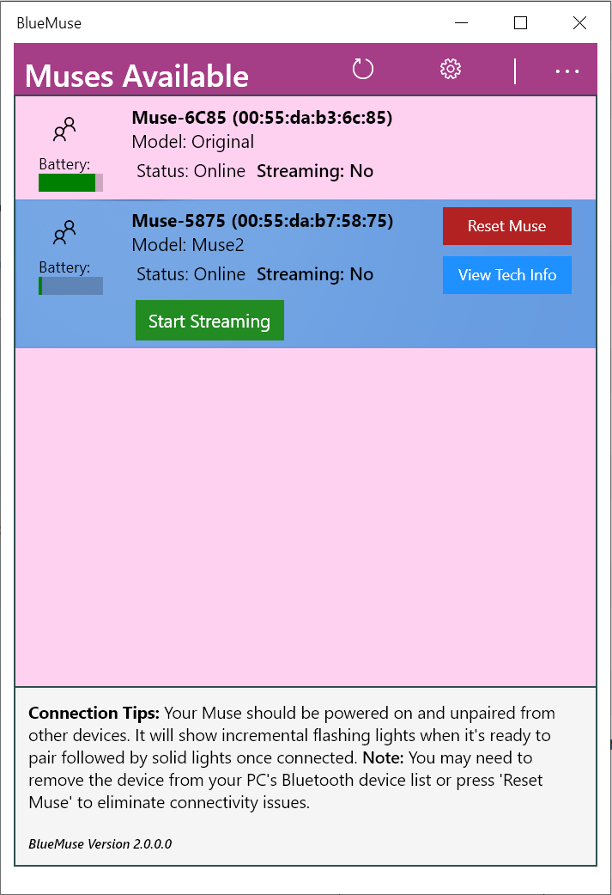

# BlueMuse
* Windows 10 app to stream data from Muse EEG headsets via LSL (Lab Streaming Layer).

# Features
* Auto detects Muse headsets and provides a visual interface to manage streams.
* Supports Muse 2016, Muse 2, and Smith Lowdown Focus glasses (device models are auto detected).
* Supports EEG, PPG, accelerometer, gyroscope, and telemetry data. *Note: PPG is only available on Muse 2*.
* Can stream from multiple Muses simultaneously (see notes).
* Choose between timestamp formats - LSL "local clock" or Unix Epoch.
* LSL streams in 64-bit or 32-bit.
* Shows latest timestamp received and the current sample rate for each stream.

# Screenshots


# Command Line Interface
**All commands will launch BlueMuse if it isn't already open.**

### Basic Operations
Start BlueMuse
```powershell
start bluemuse:
```
Close the program: 
```powershell
start bluemuse://shutdown
```

### Streaming
Start streaming first connected (online) Muse: 
```powershell
start bluemuse://start?streamfirst=true
```
Start streaming specific Muse(s) - by MAC address or device name: 
```powershell
start bluemuse://start?addresses={MAC1 or Name1},{MAC2 or Name2},{MAC3 or Name3}....
```
Start streaming all Muses: 
```powershell
start bluemuse://start?startall
```
Stop streaming specific Muse(s) - by MAC address or device name: 
```powershell
start bluemuse://stop?addresses={MAC1 or Name1},{MAC2 or Name2},{MAC3 or Name3},....
```
Stop streaming all Muses: 
```powershell
start bluemuse://stop?stopall
```

**"startall" and "stopall" are not meant for launch, they are used when BlueMuse is already running.**

### Settings
Change primary timestamp format: 
```powershell
 start bluemuse://setting?key=primary_timestamp_format!value=<BLUEMUSE|LSL_LOCAL_CLOCK_BLUEMUSE|LSL_LOCAL_CLOCK_NATIVE>
```
Change secondary timestamp format: 
```powershell
 start bluemuse://setting?key=secondary_timestamp_format!value=<BLUEMUSE|LSL_LOCAL_CLOCK_BLUEMUSE|LSL_LOCAL_CLOCK_NATIVE|NONE>
```
Change channel data type: 
```powershell
 start bluemuse://setting?key=channel_data_type!value=<float32|double64>
```
Enable / disable EEG data (applies when opening streams):
```powershell
 start bluemuse://setting?key=eeg_enabled!value=<true|false>
```
Enable / disable accelerometer data (applies when opening streams):
```powershell
 start bluemuse://setting?key=accelerometer_enabled!value=<true|false>
```
Enable / disable gyroscope data (applies when opening streams):
```powershell
 start bluemuse://setting?key=gyroscope_enabled!value=<true|false>
```
Enable / disable PPG data (applies when opening streams):
```powershell
 start bluemuse://setting?key=ppg_enabled!value=<true|false>
```
Enable / disable telemetry data (applies when opening streams):
```powershell
 start bluemuse://setting?key=telemetry_enabled!value=<true|false>
```
Toggle "always pair": 
```powershell
 start bluemuse://setting?key=always_pair!value=<true|false>
```

# Installation
***Requires Windows 10 with Fall 2017 Creators Update - Version 10.0.15063 aka Windows 10 (1703).***

### First Step
**Download [latest version](https://github.com/kowalej/BlueMuse/releases/download/v2.1/BlueMuse_2.1.0.0.zip) from the [releases page](https://github.com/kowalej/BlueMuse/releases)** and unzip, then follow one of the methods below.
### Auto Install (Recommended)
1. Navigate to the unzipped app folder and run the `.\InstallBlueMuse.ps1` PowerShell command (right click and choose Run with PowerShell or execute from terminal directly): 

2. Follow the prompts - the script should automatically install the security certificate, all dependencies, and the BlueMuse app.

### Manual Install
1. Double click BlueMuse_xxx.cer then click "Install Certificate".
2. Select current user or local machine depending on preference and click "Next".
3. Select "Place all certificates in the following store".
4. Press "Browse...".
5. Select install for Local Machine.
6. Select "Trusted Root Certification Authorities" and click "OK".
7. Click "Next" and click "Finish" to install certificate.

8. Open Dependencies folder and appropriate folder for your machine architecture.
9. Double click and install Microsoft.NET.Native.Framework.1.7 and Microsoft.NET.Native.Runtime.1.7.

10. Finally, double click and install BlueMuse_xxx.appxbundle.

# Versions
### Latest
* **2.1.0.0**
    Detect Muse S as separate device (previously detected as Muse 2).
    Muse S - enable PPG.
    Handle more exceptions during stream shutdown.

#### Older
*Note: version 2.0.0.0 and older version are available from the [ArchivedDist folder](https://github.com/kowalej/BlueMuse/tree/master/ArchivedDist). New versions (including 2.0.0.0) will be published to the [releases page](https://github.com/kowalej/BlueMuse/releases).*
* 2.0.0.0
    * Stream PPG, accelerometer, gyroscope, and telemetry data.
    * Muse 2 (and other model) auto detection. Removed "Assume Muse 2" setting.
    * Battery level indicator in the UI.
    * Added support for "tech info" which will show some device and control status information from the Muse. This data includes firmware information, serial number, battery info, and more.
    * Added button to "hard reset" the Muse. *This can sometimes help resolve connectivity issues.*
    * Cleaned up UI (improved button colours and important text is now bolded).
    * Added a lot more logging for Bluetooth and other processing errors. This will hopefully lead to remaining issues being resolved in the future.
    * Utilizing generated UWP package Install.ps1 Powershell install script (instead of calling Add-AppDevPackage directly).
* 1.1.1.0
    * **Muse 2 support (experimental) - for now, for this to work you have to go to Settings > Assume Muse 2 > Toggle On. Finally, hit Force Refresh (if your Muse was already in the list, otherwise it should work when your device is first found).** It will assume all you devices with "Muse" in the name are Muse 2's and will set the parameters accordingly. *In the future I hope to have Muse vs Muse 2 differentiation be auto detected*.
    * Added "always pair" option which may help with some people's Bluetooth issues. It is set as Off by default, you can toggle it On in the settings menu.
* 1.1.0.0
    * Choose between 32-bit (float32) or 64-bit (double64) LSL stream data formats.
* 1.0.9.0 (Note - forces streams to use double64 data format.)
    * Offering choice of timestamp format(s) (Unix Epoch or LSL local_clock).*
    * Optionally send secondary timestamp (for comparison to primary timestamp) - sent as additional LSL channel.
    * Improved UI to include settings menu. Settings menu allows user to choose timestamp formats and displays log file locations.
    * Should automatically add firewall rules when LSLBridge launches for the first time.
    
* 1.0.8.0
    * Increased timestamp accuracy by using a more precise API on Windows.
    * Added logging. See Troubleshooting -> Logs section for details.
    * LSLBridge won't falsely show stream if GATT problems occurred.
* 1.0.7.0
    * Added new install script `InstallBlueMuse.ps1`.
    * Refreshed the install certificate which was about to expire.
* 1.0.6.0 - stable. 
    * Changed timestamp format to Unix epoch **seconds** format.
    * Improved UI - it is now re-sizable and more compact (better for low resolution screens).
    * Added version number to main screen.
* 1.0.5.0 - stable. 
    * Corrected timestamps timezone issue (timestamps were meant to be GMT based, but were actually in EST). Timestamps formatted as Unix epoch **milliseconds**.
* 1.0.4.0 - stable. 
    * LSLBridge is auto hidden if no streams active. BlueMuse also polls to keep LSL bridge open if not currently streaming, therefore LSLBridge has proper auto closing mechanism that won't prematurely trigger. This process may seem strange and convoluted but it appears to be the only good method to manage this trusted process with the current Windows UWP API.
    * Bad timestamps.
* 1.0.3.0 - unstable. 
    * Issues with LSLBridge closing.
    * Bad timestamps.


# Notes
* **Requires Windows 10 with Fall 2017 Creators Update - Version 10.0.15063 aka Windows 10 (1703).**
* **Streaming multiple Muses simultaneously -** maintaining consistent data rates for multiple devices may be difficult on some machines, depending on Bluetooth and compute hardware.
* Application requires side loading a Win32 application which does the LSL streaming. This is because UWP apps run in a restricted environment with network isolation. This restricts LSL streams from being seen across the local network if launched from the  UWP app. To get around this issue, the data is shuffled through to the "LSL Bridge", a Win32 application which can run in a normal environment. Note: when you first start a stream, you may need to add a firewall exception for LSLBridge.exe.
* Uses 32-bit binaries for LSL. Acquired from: ftp://sccn.ucsd.edu/pub/software/LSL/SDK/liblsl-All-Languages-1.11.zip
* liblsl32.dll was dependent on MSVCP90.dll and MSVCR90.dll, both of which I included in the project since these may not be available in the System32 folder on your machine (they weren't on mine).
* The full dependencies of liblsl32.dll are: KERNEL32.dll, WINMM.dll, MSVCP90.dll, WS2_32.dll, MSWSOCK.dll, and MSVCR90.dll. Generated with dumpbin utility.
* Muse 2 has AUX channel disabled - if I try to stream from this channel I get errors. It looks like no data comes from the channel when debugging Bluetooth inside a sniffing tool, so I'm making the assumption that Muse 2 doesn't actually support the AUX (secret electrode) input - it just has a (non functioning) GATT characteristic which is the same UUID as the Muse (2016). 

### Timestamp Formats:

* BlueMuse High Accuracy (Unix Epoch Seconds UTC-0)
    * Recommended as primary timestamp if you don't have to time sync with other LSL streams.
    * Generates timestamps that you can use to determine date and very accurate time.
    * Settings value = BLUEMUSE.
* BlueMuse LSL Local Clock (System Uptime Seconds)
    * Recommended if syncing with other LSL streams.
    * Called exactly when packet comes in from Muse.
    * Generates timestamp by calling an equivalent function to LSL local_clock but utilizes the C++ Standard Library instead of the underlying Boost library call used by the LSL .dll.
    * Should produce the exact same value as LSL native local clock with less jitter.
    * Settings value = LSL_LOCAL_CLOCK_BLUEMUSE.
* Native LSL Local Clock - Via Bridge (System Uptime Seconds)
    * Generates timestamp by calling local_clock function from LSL .dll function directly on bridge.
    * May produce jitter.
    * Settings value = LSL_LOCAL_CLOCK_NATIVE.
* None
    * Don't send secondary timestamp.
    * Settings value = NONE.


# Troubleshooting
### If your Muse is not showing up after searching for awhile: 
  1. Ensure Muse is removed from "Bluetooth & other devices" list in control panel.
  2. Reset Muse - hold down power button until device turns off then back on.
  3. Make sure Muse is within reasonable range of your computer. Some built in Bluetooth antennas are not very powerful.
  
### Logs:
The main app (BlueMuse) and LSL Bridge both write log files for various events and exceptions. These may help in troubleshooting issues. The files can be found within AppData:

BlueMuse:

*C:\Users\{Username}\AppData\Local\Packages\07220b98-ffa5-4000-9f7c-e168a00899a6...\LocalState\Logs\BlueMuse-Log-{Timestamp}.log*

LSLBridge:

*C:\Users\{Username}\AppData\Local\Packages\07220b98-ffa5-4000-9f7c-e168a00899a6...\LocalCache\Local\Locgs\LSLBridge-Log-{Timestamp}.log*

### If working on VS Solution - missing references in LSLBridge project:
See https://docs.microsoft.com/en-us/windows/uwp/porting/desktop-to-uwp-enhance
