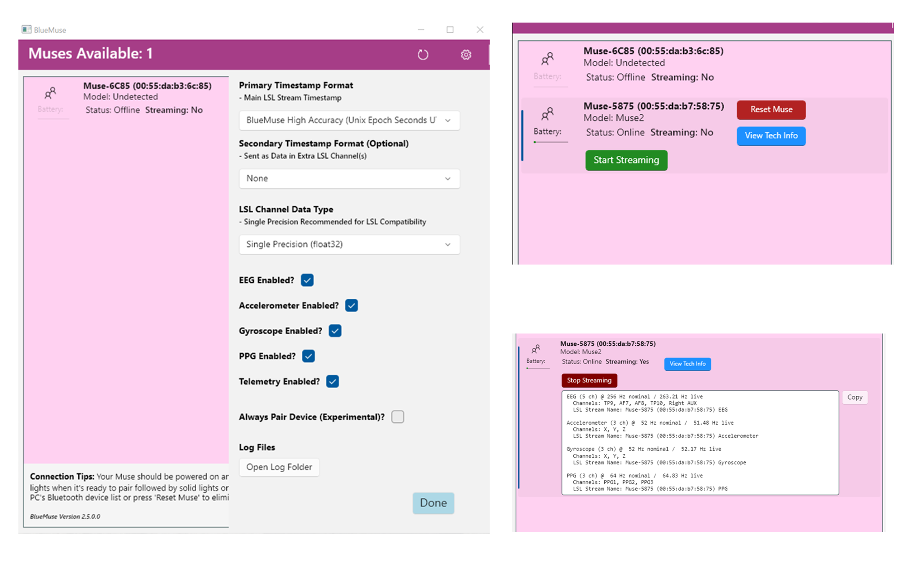

# BlueMuse
* Windows app to stream data from Muse EEG headsets via LSL (Lab Streaming Layer).


# Features
* Auto detects Muse headsets and provides a visual interface to manage streams.
* Supports Muse 2016, Muse 2, Muse S, Muse S Athena, and Smith Lowdown Focus glasses (device models are auto detected).
* Supports EEG, PPG, accelerometer, gyroscope, and telemetry data. *Note: PPG is only available on Muse 2, Muse S and Muse S Athena*.
* Can stream from multiple Muses simultaneously (see notes).
* Choose between timestamp formats - LSL "local clock" or Unix Epoch.
* LSL streams in 64-bit or 32-bit.
* Shows latest timestamp received and the current sample rate for each stream.
* Protocol control from Command Line / PowerShell.


# Screenshots



# Command Line Interface
**All commands will launch BlueMuse if it isn't already open.**

### Basic Operations
Start BlueMuse:
```powershell
start bluemuse:
```
Refresh Bluetooth list (used only while running): 
```powershell
start bluemuse://refresh
```
Close the program: 
```powershell
start bluemuse://shutdown
```

### Streaming
Start streaming first connected (online) Muse: 
```powershell
start bluemuse://start?streamfirst=true
```
Start streaming specific Muse(s) - by MAC address or device name: 
```powershell
start bluemuse://start?addresses={MAC1 or Name1},{MAC2 or Name2},{MAC3 or Name3}....
```
Start streaming all Muses: 
```powershell
start bluemuse://start?startall
```
Stop streaming specific Muse(s) - by MAC address or device name: 
```powershell
start bluemuse://stop?addresses={MAC1 or Name1},{MAC2 or Name2},{MAC3 or Name3},....
```
Stop streaming all Muses: 
```powershell
start bluemuse://stop?stopall
```

**"startall" can be used at launch (e.g. `start bluemuse://start?startall`) or while BlueMuse is already running -
it will automatically apply to any Muse discovered/connected after the command is received. "stopall" is intended
for use only while BlueMuse is already running.**

### Settings
Change primary timestamp format: 
```powershell
 start bluemuse://setting?key=primary_timestamp_format!value=<BLUEMUSE|LSL_LOCAL_CLOCK_BLUEMUSE|LSL_LOCAL_CLOCK_NATIVE>
```
Change secondary timestamp format: 
```powershell
 start bluemuse://setting?key=secondary_timestamp_format!value=<BLUEMUSE|LSL_LOCAL_CLOCK_BLUEMUSE|LSL_LOCAL_CLOCK_NATIVE|NONE>
```
Change channel data type: 
```powershell
 start bluemuse://setting?key=channel_data_type!value=<float32|double64>
```
Enable / disable EEG data (applies when opening streams):
```powershell
 start bluemuse://setting?key=eeg_enabled!value=<true|false>
```
Enable / disable accelerometer data (applies when opening streams):
```powershell
 start bluemuse://setting?key=accelerometer_enabled!value=<true|false>
```
Enable / disable gyroscope data (applies when opening streams):
```powershell
 start bluemuse://setting?key=gyroscope_enabled!value=<true|false>
```
Enable / disable PPG data (applies when opening streams):
```powershell
 start bluemuse://setting?key=ppg_enabled!value=<true|false>
```
Enable / disable telemetry data (applies when opening streams):
```powershell
 start bluemuse://setting?key=telemetry_enabled!value=<true|false>
```
Toggle "always pair": 
```powershell
 start bluemuse://setting?key=always_pair!value=<true|false>
```


# Installation
> **NOTE:** As of version 3.1.0 (the .NET 10 / WinUI 3 modernization), BlueMuse is now a single self-contained
> MSIX-packaged application (the separate "LSL Bridge" Win32 process used in 2.4.0.0 and earlier has been merged
> directly into the main app - see the [Architecture](#architecture) note below). The distribution method
> (Microsoft Store vs. sideload) is **still being finalized** - this section will be updated once that is
> confirmed. In the meantime, sideloading as described below will continue to work.

***Requires Windows 10 version 1809 (10.0.17763.0) or later, or Windows 11. Built/targeted against the Windows 11 24H2 SDK (10.0.26100.0).***

### Sideload Install (Current Method)
Each [release](https://github.com/kowalej/BlueMuse/releases) contains **two separate architecture-specific
artifacts** (x64 and x86) - download the one matching your machine (x64 for most modern PCs) and unzip it. The
unzipped folder is a self-contained, Visual-Studio-generated sideload package (e.g. `BlueMuse.App_3.1.0.0_x64`)
containing the `.msix`, the signing `.cer`, a `Dependencies` folder (with the required
`Microsoft.WindowsAppRuntime.2.msix` per CPU architecture), and PowerShell installer scripts.

#### Auto Install (Recommended)
1. **Download the [latest release](https://github.com/kowalej/BlueMuse/releases/tag/v3.1.0)** matching your architecture and unzip it.
2. Right-click `InstallBlueMuse.ps1` and choose **Run with PowerShell** (this removes any previously installed
   BlueMuse package first, then runs `Install.ps1`). Alternatively, run `Install.ps1` or `Add-AppDevPackage.ps1`
   directly if you don't need the old version removed automatically.
3. Follow the prompts - the script installs the certificate (to **Local Machine** ->
   **Trusted Root Certification Authorities**), the `Microsoft.WindowsAppRuntime.2` dependency package,
   and the BlueMuse `.msix` itself.
4. If PowerShell blocks the script from running, or Windows blocks the install because "Developer Mode"
   or sideloading isn't enabled, see the [PowerShell Installation Guide](BlueMuse_Windows_PowerShell_Install.md)
   for detailed steps (temporarily bypassing execution policy, unblocking the script, and enabling
   Developer Mode via **Settings -> Update & Security -> For Developers**).

#### Manual Install
1. Double-click the `.cer` certificate file and install it to the **Local Machine** ->
   **Trusted Root Certification Authorities** store (you'll need administrator rights for this step).
2. Open the `Dependencies\<arch>` folder and double-click `Microsoft.WindowsAppRuntime.2.msix` to install it.
3. Double-click the `.msix` package in the folder root to install BlueMuse.

*Note: releases prior to 3.1.0 (2.4.0.0 and earlier) shipped as a UWP app paired with a separate "LSL Bridge"
Win32 process and .NET Native runtime dependencies (`.appxbundle` + `Microsoft.NET.Native.Framework`/`.Runtime`
packages instead of `.msix` + `Microsoft.WindowsAppRuntime.2`), and required Windows 10 1703 or later. The same
Auto/Manual install steps above apply structurally, just with those older package names - see the
[releases page](https://github.com/kowalej/BlueMuse/releases) if you need to install one of those versions.*

#### Troubleshooting
If you run into issues with Developer Mode or PowerShell execution policy during installation, see the [PowerShell Installation Guide](./BlueMuse_Windows_PowerShell_Install.md) for detailed solutions.

### Microsoft Store (Possible In Future)
A Microsoft Store listing is being evaluated for a future release, which would remove the need for manual
certificate/sideload steps entirely. This section will be updated if a store link becomes available.


# Versions
### Latest
* 3.1.0 (stable) - Modernized & Athena Support
	* Muse S Athena support (experimental, not verified).
	* Modernized to .NET 10 / WinUI 3, converted to SDK-style project.
	* Merged the separate "LSL Bridge" Win32 process directly into the main app (single-process architecture, see [Architecture](https://github.com/kowalej/BlueMuse#architecture)).
	* UI refresh: settings moved to a slide-out side panel, improved main list layout, compact per-stream info display with latest sample values and a one-click copy button.
	* Added Muse S Athena support (see [Muse S Athena](https://github.com/kowalej/BlueMuse#muse-s-athena)).
	* Added Esc key support to collapse/deselect the currently selected Muse in the list.
	* Fixed intermittent Bluetooth/GATT communication issues (JSON parsing errors, spurious device removal, and connection churn) via reentrancy guards and per-device GATT serialization.
	* Window size is now persisted between launches, and the window/taskbar title correctly shows "BlueMuse".
* 2.4.0.0 (stable) - Last classic LSLBridge version (UWP).
	* Misc package updates.
		* Support Windows 11.
		* Last release built on UWP before the .NET 10 / WinUI 3 modernization (see 2.5.0.0 above).

See [CHANGELOG.md](./CHANGELOG.md) for the full version history.


# Notes
* **Requires Windows 10 version 1809 (10.0.17763.0) or later, or Windows 11. Built/targeted against the Windows 11 24H2 SDK (10.0.26100.0).**
* **Streaming multiple Muses simultaneously -** maintaining consistent data rates for multiple devices may be difficult on some machines, depending on Bluetooth and compute hardware.
* Uses both 32-bit and 64-bit LSL binaries (liblsl32.dll / liblsl64.dll), selected automatically at runtime based on process architecture. Acquired from: ftp://sccn.ucsd.edu/pub/software/LSL/SDK/liblsl-All-Languages-1.11.zip
* liblsl32.dll and liblsl64.dll are dependent on MSVCP90.dll and MSVCR90.dll, both of which I included in the project since these may not be available in the System32 folder on your machine (they weren't on mine).
* The full dependencies of liblsl32.dll are: KERNEL32.dll, WINMM.dll, MSVCP90.dll, WS2_32.dll, MSWSOCK.dll, and MSVCR90.dll. Generated with dumpbin utility.

### Muse S Athena
The Muse S Athena uses a different protocol from every earlier headband, so it is handled as its own model (`MuseSAthena`). Detection is automatic - it is the only Muse exposing GATT characteristic `273e0013-...`, which is probed before the name based Muse S check since Athena also advertises as `MuseS-****`.

Differences worth knowing if you are reading the data:

* **Multiplexed data characteristics, not one per channel.** Every sensor is multiplexed into tagged packets on `273e0013-...` and `273e0014-...` (both are subscribed, as in `muselsl` and BrainFlow), so a single Bluetooth notification can carry EEG, IMU, optics and battery at once. All enabled LSL outlets are therefore opened before streaming starts rather than on first packet.
* **EEG** is 4 channels x 4 samples per packet (chunk size 4, not 12), 14-bit offset binary LSB-first, scaled over a 1450 uV full range after subtracting the 2^13 midpoint (the legacy 12-bit samples subtract 2048). The 8 channel packet layout is also decoded, with the four headband electrodes published.
* **Accelerometer and gyroscope share one packet** (6 channels x 3 samples) and are split across the two existing LSL streams. The accelerometer scale matches the older headbands; **the gyroscope scale is negated** relative to them.
* **Optics (fNIRS)** is published on the PPG stream as 16 channels of raw 20-bit detector counts, labelled `OPTICS0`..`OPTICS15`. The 4 and 8 channel packet layouts carry a subset of the same canonical channels, and the channels a packet does not carry are published as zero.
* **Telemetry** is battery percent only - the older four channel battery / fuel / voltage / temperature block does not exist. The raw value is in 1/512ths of a percent.
* **Timestamps** come from the host arrival time of each notification, dejittered per stream by a recursive least squares fit of sample index against arrival time (as `muselsl` does) - the packet header carries a packet index but no device clock. Sample spacing therefore reflects the fitted sample rate rather than Bluetooth delivery jitter.
* Starting a stream requires an ASCII command handshake (`v6`, `s`, `h`, `p1041`, `s`, then `dc001`, `dc001`, `L1`, `s`) with specific inter-command delays, rather than a single start command.

Decoding matches [`muselsl`'s Athena support](https://github.com/alexandrebarachant/muse-lsl/pull/228), since BlueMuse is commonly used as the Windows backend for it.

The protocol code in `BlueMuse.App/Athena` has no Windows dependencies and has a self-check that runs anywhere .NET 8 is available: `cd Tests/BlueMuse.Athena.Tests && dotnet run`.


### Architecture
BlueMuse previously ran the LSL streaming logic in a separate "LSL Bridge" Win32 process, because UWP apps ran
in a network-isolated sandbox that prevented LSL streams from being visible on the local network. As of the
.NET 10 / WinUI 3 modernization, BlueMuse runs as a single unpackaged-network-capable desktop app, and the LSL
streaming logic (`LSLStreamManager`) now runs in-process - there is no longer a separate bridge executable, and
no firewall exception is required for a second process.

### Timestamp Formats:

* BlueMuse High Accuracy (Unix Epoch Seconds UTC-0)
    * Recommended as primary timestamp if you don't have to time sync with other LSL streams.
    * Generates timestamps that you can use to determine date and very accurate time.
    * Settings value = BLUEMUSE.
* BlueMuse LSL Local Clock (System Uptime Seconds)
    * Recommended if syncing with other LSL streams.
    * Called exactly when packet comes in from Muse.
    * Generates timestamp by calling an equivalent function to LSL local_clock but utilizes the C++ Standard Library instead of the underlying Boost library call used by the LSL .dll.
    * Should produce the exact same value as LSL native local clock with less jitter.
    * Settings value = LSL_LOCAL_CLOCK_BLUEMUSE.
* Native LSL Local Clock - Via Bridge (System Uptime Seconds)
    * Generates timestamp by calling local_clock function from LSL .dll function directly on bridge.
    * May produce jitter.
    * Settings value = LSL_LOCAL_CLOCK_NATIVE.
* None
    * Don't send secondary timestamp.
    * Settings value = NONE.


# Troubleshooting
### If your Muse is not showing up after searching for awhile: 
  1. Ensure Muse is removed from "Bluetooth & other devices" list in control panel.
  2. Reset Muse - hold down power button until device turns off then back on.
  3. Make sure Muse is within reasonable range of your computer. Some built in Bluetooth antennas are not very powerful.
  
### Logs:
BlueMuse writes a log file for various events and exceptions, which may help in troubleshooting issues. The file can be found within AppData:

*C:\Users\\{Username}\AppData\Local\Packages\\{PackageFamilyName}\LocalState\Logs\BlueMuse-Log-{Timestamp}.log*

You can also open the log folder directly from the app via **Settings -> Open Log Folder**.
